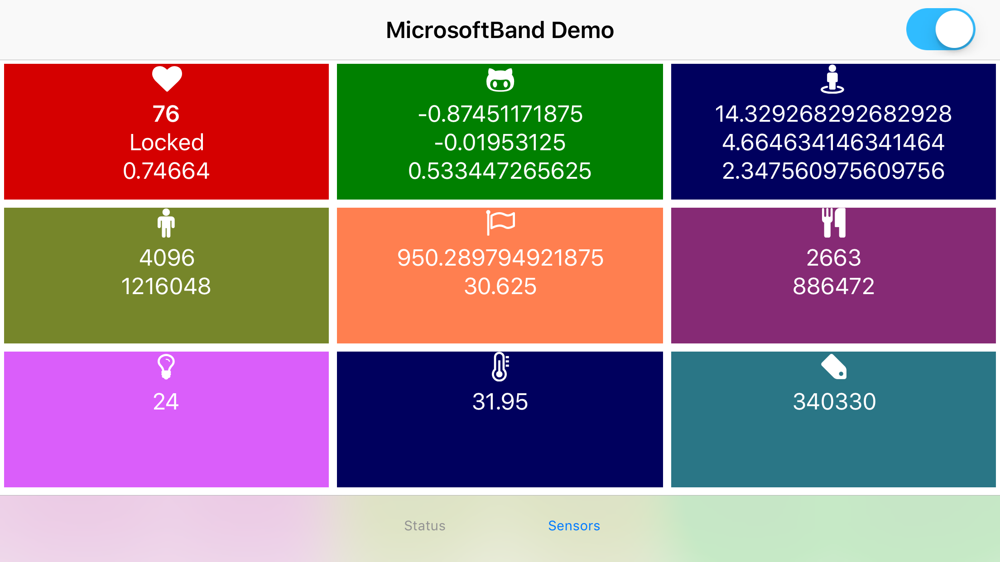

MicrosoftBand Plugin for Telerik NativeScript
=============================================
This NativeScript plugin enables to build Mobile apps to display [Microsoft Band](https://www.microsoft.com/microsoft-band/en-us) sensors data.
This plugin uses MicrosoftBand [CocoaPod](https://github.com/xmlking/MicrosoftBand) written in **Swift** and [Band SDK](https://developer.microsoftband.com/bandsdk).




## Install

### Prerequisites

1. NodeJS > 7.x
2. NativeScript CLI

### Plugin

```sh
tns plugin add @xmlking/nativescript-ngx-microsoftband
```


## Usage

### 1. import the MicrosoftBandModule module

```typescript
import { NgModule, NO_ERRORS_SCHEMA } from "@angular/core";
import { NativeScriptModule } from "nativescript-angular/nativescript.module";
import { MicrosoftBandModule } from '@xmlking/nativescript-ngx-microsoftband';

import { AppComponent } from "./app.component";

@NgModule({
  imports: [
    NativeScriptModule,
    MicrosoftBandModule.forRoot()
  ],
  declarations: [
    AppComponent
  ],
  bootstrap: [
    AppComponent
  ],
  schemas: [
    NO_ERRORS_SCHEMA
  ]
})
export class AppModule { }
```

### 2. use it in your service/component

Refer [app.component.ts](src/app/app.component.ts) and [heart-rate.component.ts](src/app/components/heart-rate.component.ts)


## Build

> Building and publishing the plugin.

## Prerequisites
```bash
yarn global add ts-node
yarn global add rollup
```

### Setup
```
yarn run setup
```

### build
```bash
yarn run build
```

### publish
```bash
cd dist
npm publish
```

## Example App

> Setup and Run Example app

### Setup
```
cd src
tns plugin remove @xmlking/nativescript-ngx-microsoftband; tns plugin add ../dist
```

### Run
```
cd src
tns prepare ios
tns build ios
# open src/platforms/ios/src.xcworkspace project in xcode and run on attached iOS devise.
```

## Credits

Idea came from [NathanWalker](https://github.com/NathanWalker), [Minko Gechev](https://github.com/mgechev)

## Contributors


# License

[MIT](/LICENSE)
